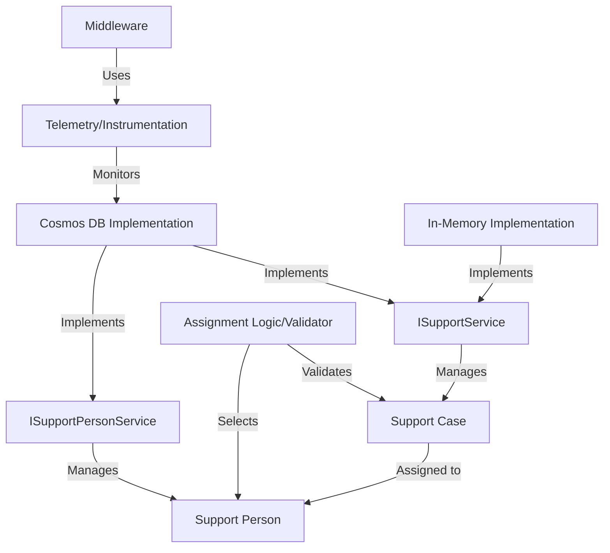

# Tutorial: ContosoAdsSupport

The ContosoAdsSupport project manages *support cases* (like IT tickets) and assigns them to *support persons* (agents). It uses **Cosmos DB** for data storage and provides APIs for creating, reading, updating, and deleting cases and agent profiles.  The system aims to automate support case assignment based on agent expertise and workload.

**Source Repository:** [None](None)

## Chapters

1. [Support Case](01_support_case.md)
2. [Support Person](02_support_person.md)
3. [ISupportService](03_isupportservice.md)
4. [ISupportPersonService](04_isupportpersonservice.md)
5. [Assignment Logic/Validator](05_assignment_logic_validator.md)
6. [Cosmos DB Implementation](06_cosmos_db_implementation.md)
7. [In-Memory Implementation](07_in_memory_implementation.md)
8. [Telemetry/Instrumentation](08_telemetry_instrumentation.md)
9. [Middleware](09_middleware.md)

