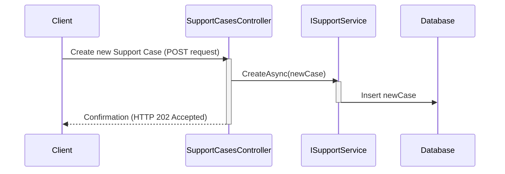

# Chapter 1: Support Case

Imagine you're a customer having trouble logging into your ContosoAds account.  Frustrated, you contact Contoso support.  They create a "Support Case" for you.  Think of a Support Case like a digital form that tracks everything about your problem – your login issue, your contact details, who's helping you, and the progress being made.

This chapter will explain what a Support Case is, how it's represented in our `ContosoAdsSupport` project, and why it's important.

## What Problem Does a Support Case Solve?

Without Support Cases, customer issues might get lost, forgotten, or handled inefficiently.  A Support Case ensures every problem is recorded, tracked, and ultimately resolved.

## Understanding the Support Case

In `ContosoAdsSupport`, a Support Case is represented by the `SupportCase` class (found in `src\ContosoAdsSupport\ContosoSupport\Models\SupportCase.cs`). It's like a container holding all the important details about a customer's problem.

Here's a simplified peek:

```csharp
public class SupportCase
{
    public string? Id { get; set; } // Unique identifier for the case
    public string? Title { get; set; }  // Short description of the issue
    public string? Description { get; set; } // Detailed explanation of the problem
    public string? Owner { get; set; } // The customer who reported the issue
    // ... other properties related to assignment and reasoning
}
```

Each piece of information is stored as a *property* of the `SupportCase` object.  For example, `Title` stores the short description of the issue, like "Login Issue".  `Description` might contain more details: "Unable to login using correct password.  Error message received: 'Invalid credentials.'"

## Using the Support Case

Let's say you want to create a new Support Case for the customer's login issue.  Here's a simplified example:

```csharp
// ... other code ...

var newCase = new SupportCase
{
    Title = "Login Issue",
    Description = "Unable to login using correct password.",
    Owner = "John Doe"
};

// ... code to save the newCase ...
```

This code creates a new `SupportCase` object and sets its `Title`, `Description`, and `Owner` properties.  Later, this object would be saved to a database.

## Internal Implementation

When a new `SupportCase` is created, the `SupportCasesController` (found in  `src\ContosoAdsSupport\ContosoSupport\Controllers\SupportCasesController.cs`) interacts with the `ISupportService` (see [ISupportService](03_isupportservice.md)) to store it.  Let's visualize this with a simplified sequence diagram:



The `SupportServiceCosmosDb` (if using Cosmos DB) or `SupportServiceInMemory` (if using in-memory storage) implements the actual saving logic. Here's a simplified snippet from `SupportServiceCosmosDb`:

```csharp
// ...other code

public async Task CreateAsync(SupportCase supportCase)
{
    // ... other code (validation, etc.) ...

    await supportCases.InsertOneAsync(supportCase).ConfigureAwait(false);

    // ... other code ...
}
```

This code inserts the `supportCase` object into the database.

## Conclusion

We've learned that a Support Case is a crucial part of the `ContosoAdsSupport` system. It provides a structured way to track and manage customer issues.  Next, we'll look at the [Support Person](02_support_person.md) who handles these cases.


---

Generated by [AI Codebase Knowledge Builder](https://github.com/The-Pocket/Tutorial-Codebase-Knowledge)