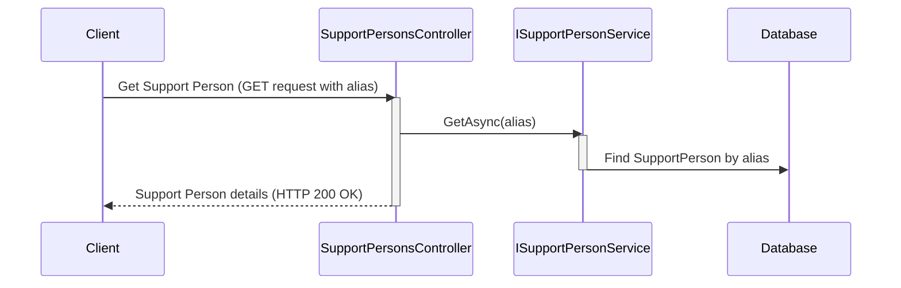

# Chapter 2: Support Person

In the previous chapter, [Support Case](01_support_case.md), we learned how ContosoAdsSupport tracks customer issues using `SupportCase` objects. Now, let's meet the people who actually solve these issues: the Support Persons.

## What Problem Does a Support Person Solve?

Imagine a pile of Support Cases waiting to be handled.  How do we decide who's the best person to tackle each case? A Support Person profile helps us match the right expert to the right problem.  It's like finding the perfect key for each lock.

## Understanding the Support Person

In `ContosoAdsSupport`, each support representative is represented by a `SupportPerson` object. This object stores information about their skills, workload, and performance.  Think of it as a digital profile for each agent.

Here's a simplified peek at the `SupportPerson` class (found in `src\ContosoAdsSupport\ContosoSupport\Models\SupportPerson.cs`):

```csharp
public class SupportPerson
{
    public string Alias { get; set; } // Unique username
    public string Name { get; set; }  // Full name
    public List<string> Specializations { get; set; } // Skills like "Networking", "Database"
    // ... other properties
}
```

For example, a Support Person named "Alice" might have `Alias` "alice.wonderland" and `Specializations` including "Networking" and "Security".

## Using the Support Person

Let's say we need to find a Support Person who specializes in "Database" issues.  Here's a simplified example of how we might retrieve such a person:

```csharp
// ... other code ...

// Assuming supportPersonService is an instance of ISupportPersonService
var databaseExperts = await supportPersonService.GetAsync(specialization: "Database"); 

// ... code to use databaseExperts ...
```

This code retrieves a list of `SupportPerson` objects who have "Database" listed in their `Specializations`.

## Internal Implementation

When we request Support Person details, the `SupportPersonsController` (found in `src\ContosoAdsSupport\ContosoSupport\Controllers\SupportPersonsController.cs`) interacts with the [ISupportPersonService](04_isupportpersonservice.md).

Let's visualize retrieving a Support Person with a sequence diagram:




The `SupportPersonServiceCosmosDb` (if using Cosmos DB) implements the actual retrieval logic. Here's a simplified snippet:

```csharp
// ... other code ...

public async Task<SupportPerson?> GetAsync(string alias)
{
    // ... other code ...

    var result = await supportPersons.Find(sp => sp.Alias == alias).FirstOrDefaultAsync();

    // ... other code ...

    return result;
}
```

This code searches the database for a `SupportPerson` with the matching `Alias`.

## Conclusion

We've learned that a Support Person represents a support representative and their skills within the `ContosoAdsSupport` system. In the next chapter, [ISupportService](03_isupportservice.md), we'll explore how the system manages and interacts with [Support Cases](01_support_case.md).


---

Generated by [AI Codebase Knowledge Builder](https://github.com/The-Pocket/Tutorial-Codebase-Knowledge)