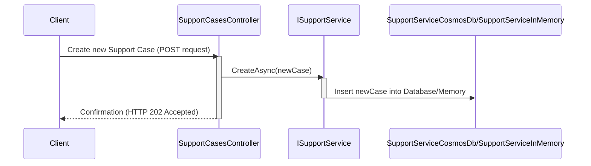

# Chapter 3: ISupportService

In the previous chapters, we learned about [Support Cases](01_support_case.md) and the [Support Persons](02_support_person.md) who handle them.  This chapter introduces `ISupportService`, the interface that acts as the bridge between our application and the database where we store Support Cases.  Think of it as a control panel for managing support tickets.

## What Problem Does ISupportService Solve?

Imagine you need to create a new Support Case, retrieve existing ones, or update their details.  You wouldn't want to write complex database queries every time you perform these actions. `ISupportService` provides a simplified set of methods for interacting with Support Cases, regardless of where they're stored (e.g., Cosmos DB, in-memory storage).  It hides the complexities of database interactions behind a clean, easy-to-use interface.

## Understanding ISupportService

`ISupportService` (found in `src\ContosoAdsSupport\ContosoSupport\Services\ISupportService.cs`) defines a set of methods for managing Support Cases.  Think of it like a contract that different implementations must adhere to.

Here's a simplified look:

```csharp
public interface ISupportService
{
    Task CreateAsync(SupportCase supportCase);
    Task<SupportCase?> GetAsync(string id);
    // ... other methods for updating, deleting, and retrieving multiple cases
}
```

Each method in the interface represents a specific action:

- `CreateAsync`: Creates a new Support Case.
- `GetAsync`: Retrieves a Support Case by its ID.
- `UpdateAsync`: Updates an existing Support Case.
- `RemoveAsync`: Deletes a Support Case.

## Using ISupportService

Let's say we want to create a new Support Case. Here's how we would use `ISupportService`:

```csharp
// ... assuming supportService is an instance of a class that implements ISupportService

var newCase = new SupportCase { Title = "Login Issue", /* ... other properties */ };
await supportService.CreateAsync(newCase); // Creates the new case
```

This code creates a new `SupportCase` object and uses `supportService.CreateAsync` to save it. Behind the scenes, the specific implementation (e.g. `SupportServiceCosmosDb`) will handle the database interaction. The `newCase` will be saved to the database.

## Internal Implementation

When `CreateAsync` is called, the `SupportCasesController` (found in `src\ContosoAdsSupport\ContosoSupport\Controllers\SupportCasesController.cs`) interacts with the concrete implementation of `ISupportService`.

Let's visualize this with a sequence diagram:



Here's a simplified snippet from `SupportServiceCosmosDb` (found in `src\ContosoAdsSupport\ContosoSupport\Services\SupportServiceCosmosDb.cs`) showing how `CreateAsync` might be implemented:

```csharp
public async Task CreateAsync(SupportCase supportCase)
{
    // ... other code (validation, etc.) ...
    await supportCases.InsertOneAsync(supportCase).ConfigureAwait(false);
    // ... other code ...
}
```

This code inserts the `supportCase` into the Cosmos DB collection. `SupportServiceInMemory` would have a similar implementation but would store the case in memory.

## Conclusion

We've learned that `ISupportService` provides a consistent way to interact with Support Cases regardless of the underlying storage mechanism. This allows for flexibility and makes the code easier to maintain and test. In the next chapter, we'll look at [ISupportPersonService](04_isupportpersonservice.md), the interface for managing [Support Persons](02_support_person.md).


---

Generated by [AI Codebase Knowledge Builder](https://github.com/The-Pocket/Tutorial-Codebase-Knowledge)