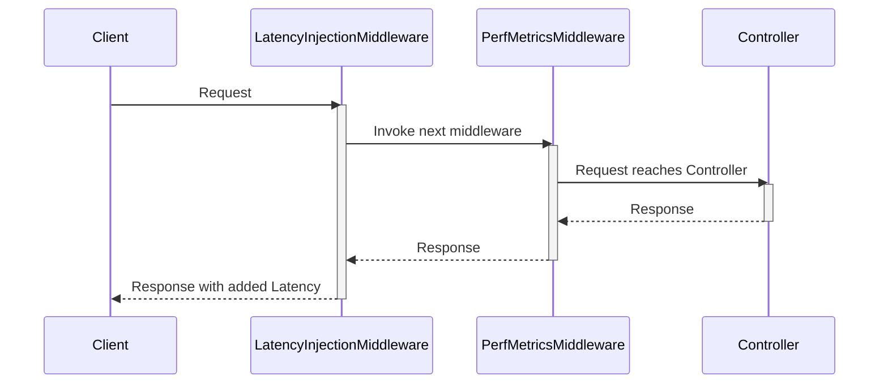

# Chapter 9: Middleware

In the previous chapter, [Telemetry/Instrumentation](08_telemetry_instrumentation.md), we learned how to add monitoring to our application.  Now, let's explore *middleware*, components that act like gatekeepers, intercepting requests and performing actions before they reach the core application logic.

## What Problem Does Middleware Solve?

Imagine you want to add a feature to `ContosoAdsSupport` that simulates network latency for testing purposes.  You could add this latency code directly into your controllers, but that would clutter your code and make it harder to maintain. Middleware provides a clean way to add this functionality without modifying your core application logic.  It's like adding a separate checkpoint before the main entrance, where specific checks or actions can be performed without disturbing the main flow.

## Understanding Middleware

Middleware components are chained together, and each component can decide whether to pass the request to the next component in the chain or short-circuit the request and return a response directly. Think of it like an assembly line, where each station performs a specific task before passing the product to the next station.

## Using Middleware

In `ContosoAdsSupport`, the `LatencyInjectionMiddleware` (found in  `src\ContosoAdsSupport\ContosoSupport\Middleware\LatencyInjectionMiddleware.cs`) demonstrates how to inject artificial latency. This is useful for testing how the application behaves under different network conditions.

To use this middleware, you send a request with the `x-ms-added-latency` header specifying the desired delay in milliseconds.  For example:

```
GET /supportcases HTTP/1.1
x-ms-added-latency: 2000
```

This would add a 2-second delay before processing the request.

## Internal Implementation

Let's visualize how middleware works with a sequence diagram:



Here's a simplified look at the `LatencyInjectionMiddleware.Invoke` method:

```csharp
// ... other code ...

if (delayMs > 0)
{
    // ... logging ...
    await Task.Delay(delayMs); // Inject the delay
}

await _next(context); // Pass to the next middleware
```

This code checks if a delay is specified in the `x-ms-added-latency` header. If so, it uses `Task.Delay` to pause execution for the specified duration.  Crucially, it then calls `_next(context)` to pass the request to the next middleware component in the chain (in this case, `PerfMetricsMiddleware`).

Another example of middleware in `ContosoAdsSupport` is the `PerfMetricsMiddleware` (covered in [Telemetry/Instrumentation](08_telemetry_instrumentation.md)), which collects performance metrics.

## Conclusion

We learned that middleware components provide a powerful way to intercept and process requests before they reach our application's core logic. This allows us to add functionalities like latency injection or performance monitoring without cluttering our controllers.  Middleware acts like a customizable pipeline, allowing us to insert specific actions at different stages of request processing.


