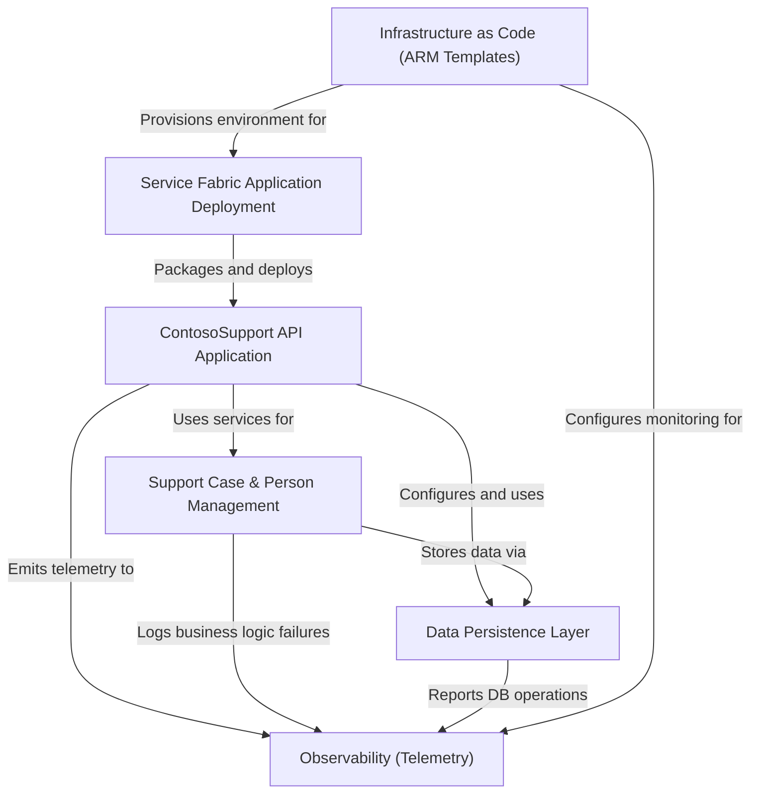

# Tutorial: ContosoSupport

The `ContosoSupport` project is an **ASP.NET Core API application** that serves as the public interface for a customer support ticketing system. It manages core entities like *support cases* and *support persons*, handling requests for their creation, retrieval, update, and deletion. The application leverages **Azure Cosmos DB** for data storage and is designed for deployment on **Azure Service Fabric**, with its infrastructure defined and managed using **Azure Resource Manager (ARM) templates** for automated provisioning. **OpenTelemetry** and **Geneva Monitoring** are integrated throughout to provide comprehensive observability and performance monitoring.

## Visual Overview

## Chapters

1. [ContosoSupport API Application
](01_contososupport_api_application_.md)
2. [Support Case & Person Management
](02_support_case___person_management_.md)
3. [Data Persistence Layer
](03_data_persistence_layer_.md)
4. [Observability (Telemetry)
](04_observability__telemetry__.md)
5. [Service Fabric Application Deployment
](05_service_fabric_application_deployment_.md)
6. [Infrastructure as Code (ARM Templates)
](06_infrastructure_as_code__arm_templates__.md)
