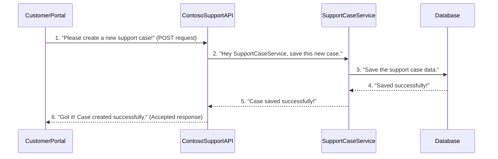

# Chapter 1: ContosoSupport API Application

Welcome to the exciting world of the Contoso Support system! In this chapter, we're going to meet the "brain" of our system: the **ContosoSupport API Application**. Think of it as the main office or the reception desk for Contoso's entire customer support operation.

### Why do we need a "Main Office"?

Imagine a customer has an issue with their Contoso product. They need a way to tell Contoso about it, right? This is where our "main office" comes in. It's the central place where all requests from customers (or other Contoso systems) come in.

Let's use a very common situation as our main example: **a customer needs to create a new support case.**

Without a central application, it would be chaotic! How would the customer know where to send their request? How would Contoso make sure the request goes to the right people and gets processed correctly? The ContosoSupport API Application solves this problem by providing a clear, organized way to receive and handle all these incoming requests.

### What is an API? (A Restaurant Analogy)

You might see the term "API" (Application Programming Interface) and wonder what it means. It's simpler than it sounds!

Think of an API like a menu at a restaurant.

*   When you want to order food, you don't go into the kitchen yourself.
*   Instead, you look at the menu (the API).
*   The menu lists what you can order (like "Get a Burger" or "Order a Pizza").
*   You tell the waiter your order (make a "request" to the API).
*   The kitchen prepares your food.
*   The waiter brings your food back (the "response" from the API).

In our ContosoSupport system, the API application acts like the waiter and the menu. It tells other programs (like a customer's website or an internal tool) what kinds of support requests they can make and how to ask for them.

### Built with ASP.NET Core

Our "main office" is built using something called **ASP.NET Core**. This is a special toolkit (or "framework") that helps developers build web applications, especially those that act as APIs. It's like having a set of specialized tools to quickly build and organize our "reception desk".

### How do we Create a Support Case?

To create a support case, another system (let's call it the "customer portal") needs to send a request to our ContosoSupport API Application. This request needs to contain all the details about the customer's issue.

The API Application has specific "entry points" or **endpoints** for different actions. For creating a support case, there's a special endpoint designed just for that.

Let's imagine the "customer portal" sends a request that looks something like this (this is a simplified example, not actual code):

```
To: ContosoSupport API Application
Action: Create New Support Case
Details:
  - Customer Name: Jane Doe
  - Product: Contoso Widget X
  - Issue: Widget makes strange noises
  - Priority: High
```

When the ContosoSupport API Application receives this, it will process it and then send back a message. This message might say "Success! Your case has been created with ID #12345" or "Error: Missing customer name."

### Looking at the Code: The "Receptionists" (Controllers)

Inside our ContosoSupport API Application, we have special components called **Controllers**. You can think of them as the "receptionists" who handle different types of requests.

For example, we have one receptionist for `SupportCases` (handling all requests about support tickets) and another for `SupportPersons` (handling requests about our support staff).

Let's look at a simplified part of the `SupportCasesController` which handles creating a new support case:

```csharp
// File: src/ContosoAdsSupport/ContosoSupport/Controllers/SupportCasesController.cs

namespace ContosoSupport.Controllers
{
    // This tells ASP.NET Core that this class handles web requests
    [ApiController]
    // This defines the web address for support case requests
    [Route("{subscriptionId}/{resourceGroup}/{resourceId}/cases")]
    public class SupportCasesController(ISupportService supportService, ILogger<SupportCasesController> logger) : ControllerBase
    {
        // ... (other parts of the controller) ...

        [HttpPost] // This means this method handles "POST" requests (used for creating new things)
        public async Task<IActionResult> PostSupportCaseAsync(string subscriptionId, string resourceGroup, string resourceId, [FromBody] SupportCase supportCase)
        {
            // The API receives the supportCase details here
            // It then asks an internal service to do the actual creation
            await supportService.CreateAsync(supportCase!); // This line does the "real work"
            
            return Accepted(); // Tells the sender "We got your request!"
        }

        // ... (other parts of the controller) ...
    }
}
```

**Explanation of the Code:**

*   `[ApiController]` and `[Route(...)]`: These lines tell ASP.NET Core that this C# class is a "Controller" and what kind of web addresses it should listen to.
*   `[HttpPost]`: This is like a sign on the "reception desk" that says, "If you want to create something new, send a POST request here!"
*   `PostSupportCaseAsync(...)`: This is the actual code that runs when someone sends a request to create a new support case.
*   `supportService.CreateAsync(supportCase!)`: This is a very important line! It shows that our "receptionist" (the controller) doesn't do the actual work of saving the support case itself. Instead, it **delegates** this task to an "internal service." We'll learn more about these services in the next chapter!
*   `return Accepted();`: This sends a simple "OK, I got it!" message back to whoever sent the request.

### What Happens Inside? (The Flow)

When a request comes into our ContosoSupport API Application, here's a simple step-by-step breakdown of what happens:



**Detailed Steps:**

1.  **Customer Portal sends a request**: The `CustomerPortal` (or any other application) sends a `POST` request to our ContosoSupport API, asking to create a new support case.
2.  **API Application receives request**: The `ContosoSupportAPI` (specifically, our `SupportCasesController`) receives this request. It checks what kind of request it is (`POST` to `/cases`) and sees that it needs to create a new `SupportCase`.
3.  **API talks to internal service**: The `ContosoSupportAPI` doesn't know *how* to save a support case. It knows *who* knows how to do it: the `SupportCaseService`. So, it passes the support case details to this service.
4.  **Internal service does the work**: The `SupportCaseService` is responsible for the actual "management" of support cases. It then interacts with the `Database` to store the new support case information.
5.  **Service reports back**: The `SupportCaseService` tells the `ContosoSupportAPI` that the case has been saved successfully.
6.  **API responds to caller**: Finally, the `ContosoSupportAPI` sends a response back to the `CustomerPortal`, confirming that the support case was created.

This design keeps our "main office" (`ContosoSupportAPI`) clean and focused on receiving and directing requests, while dedicated "departments" (`SupportCaseService`, `SupportPersonService`) handle the actual details of managing cases and people.

### Setting Up the "Main Office"

The main setup of our ContosoSupport API Application happens in a file called `Program.cs`. This file is like the blueprint for building our "main office" application.

Here's a small part of it:

```csharp
// File: src/ContosoAdsSupport/ContosoSupport/Program.cs

var builder = WebApplication.CreateBuilder(args);

// This line sets the web address where our API listens for requests
builder.WebHost.UseUrls(urls: builder.Configuration.GetValue<string>("Host:Urls")
    ?? throw new ArgumentNullException("Host:Urls"));

// This tells our application to use Controllers (like SupportCasesController)
builder.Services.AddMvc(options => options.EnableEndpointRouting = false);

// These lines register our internal services, like the one for support cases
builder.Services
    .AddSingleton<ISupportService, SupportServiceCosmosDb>() // Service for Support Cases
    .AddSingleton<ISupportPersonService, SupportPersonServiceCosmosDb>(); // Service for Support Persons

var app = builder.Build();

// ... (more setup for how the app behaves) ...

app.UseMvc(); // Makes our Controllers available

app.Run(); // Starts the application, opening the "main office" doors!
```

**Explanation:**

*   `builder.WebHost.UseUrls`: This specifies the web address (like `http://localhost:5000`) where our API will be accessible.
*   `builder.Services.AddMvc()`: This line is crucial! It tells ASP.NET Core to set up everything needed for our "Controllers" (our receptionists) to work.
*   `AddSingleton<ISupportService, SupportServiceCosmosDb>()`: This line is important because it tells our API application: "When someone needs to do something with a support case, use the `SupportServiceCosmosDb` to do it." We'll dive into what `ISupportService` and `SupportServiceCosmosDb` mean in the next chapter. This is how the "receptionist" knows which "department" to send the work to.

### Conclusion

In this chapter, we've explored the **ContosoSupport API Application**, the central "main office" for our support system. We learned that it's:

*   The public face of our support system, receiving all customer requests.
*   Built using **ASP.NET Core**, a powerful tool for web applications.
*   Organized with **Controllers** acting as "receptionists" for different types of requests (like `SupportCasesController` for support tickets).
*   Designed to **delegate** the actual work to internal services, keeping its role focused on receiving and routing requests.

Now that we understand how requests arrive at the "main office," you might be wondering: How does the "SupportCaseService" actually *manage* support cases and support people? What kind of work do these internal services perform? That's exactly what we'll cover in the next chapter!

[Next Chapter: Support Case & Person Management](02_support_case___person_management_.md)

---

<sub><sup>**References**: [[1]](https://github.com/davidkhalifa/ContosoSupport/blob/c01f43d9f8c812eb393ce94a0c83eca726799fd7/src/ContosoAdsSupport/ContosoSupport/ContosoSupport.csproj), [[2]](https://github.com/davidkhalifa/ContosoSupport/blob/c01f43d9f8c812eb393ce94a0c83eca726799fd7/src/ContosoAdsSupport/ContosoSupport/Controllers/SupportCasesController.cs), [[3]](https://github.com/davidkhalifa/ContosoSupport/blob/c01f43d9f8c812eb393ce94a0c83eca726799fd7/src/ContosoAdsSupport/ContosoSupport/Controllers/SupportPersonsController.cs), [[4]](https://github.com/davidkhalifa/ContosoSupport/blob/c01f43d9f8c812eb393ce94a0c83eca726799fd7/src/ContosoAdsSupport/ContosoSupport/Program.cs), [[5]](https://github.com/davidkhalifa/ContosoSupport/blob/c01f43d9f8c812eb393ce94a0c83eca726799fd7/src/ContosoAdsSupport/ContosoSupport/Properties/launchSettings.json), [[6]](https://github.com/davidkhalifa/ContosoSupport/blob/c01f43d9f8c812eb393ce94a0c83eca726799fd7/src/ContosoAdsSupport/ContosoSupport/appsettings.Development.json), [[7]](https://github.com/davidkhalifa/ContosoSupport/blob/c01f43d9f8c812eb393ce94a0c83eca726799fd7/src/ContosoAdsSupport/ContosoSupport/appsettings.json), [[8]](https://github.com/davidkhalifa/ContosoSupport/blob/c01f43d9f8c812eb393ce94a0c83eca726799fd7/src/ContosoAdsSupport/ContosoSupport/wwwroot/index.html)</sup></sub>