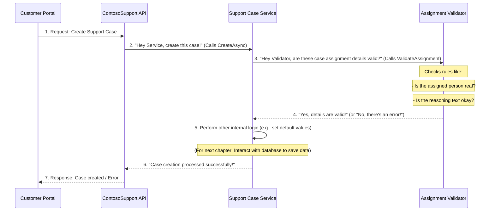

# Chapter 2: Support Case & Person Management

Welcome back! In [Chapter 1: ContosoSupport API Application](01_contososupport_api_application_.md), we learned that our ContosoSupport API Application acts like the central "main office" or "reception desk." It receives all the requests, like when a customer wants to create a new support case.

But what happens *after* the "receptionist" (the `Controller`) gets the request? The "receptionist" doesn't actually solve the customer's problem or manage the company's staff. Just like in a real office, they send the request to the right "department."

This chapter is all about those specialized "departments": **Support Case Management** and **Support Person Management**. These are the core parts of our system that handle the "real work" of tracking customer issues (Support Cases) and managing our support agents (Support Persons).

### Why Do We Need Special "Departments"?

Imagine if our receptionists had to know *everything* about customer support: how to file a case, how to assign it, how to find an available agent, what rules apply to agent details, and so on. That would be too much!

Instead, we have dedicated "departments" that are experts in their specific areas:

*   **Support Case Department**: Handles all tasks related to customer issues, like creating a new ticket, finding an existing one, or updating its status.
*   **Support Person Department**: Manages information about our support agents, like their names, special skills, and current availability.

These "departments" ensure that information is managed correctly and consistently, following all the business rules.

### The "Records": SupportCase and SupportPerson

At the heart of any management system are the "records" or "items" it manages. In our ContosoSupport system, these are:

1.  **`SupportCase`**: This represents a single customer issue or ticket. Think of it as a digital form filled out for each problem.
2.  **`SupportPerson`**: This represents a single support agent or employee. Think of it as a digital employee profile.

Let's look at what kind of information these "records" hold:

#### The Support Case "Form" (`SupportCase.cs`)

```csharp
// File: src/ContosoAdsSupport/ContosoSupport/Models/SupportCase.cs

namespace ContosoSupport.Models
{
    public class SupportCase
    {
        public string? Id { get; set; } // Unique ID for the case
        public string? Title { get; set; } // Short summary of the issue
        public string? Description { get; set; } // Detailed explanation
        public string? Owner { get; set; } // Who reported the issue (customer)
        public bool IsComplete { get; set; } // Is the issue resolved?
        public string? AssignedSupportPerson { get; set; } // Who is working on it?
        // ... (other details like assignment reasoning)
    }
}
```

*   **`Id`**: A unique number or code for each support case, like a ticket number.
*   **`Title`**: A short, catchy name for the problem, e.g., "Login Issues on Website."
*   **`Description`**: A detailed explanation of what's going wrong.
*   **`Owner`**: The customer who submitted the case.
*   **`IsComplete`**: A checkbox indicating if the problem is solved.
*   **`AssignedSupportPerson`**: The name of the support agent currently handling this case.

#### The Support Person "Profile" (`SupportPerson.cs`)

```csharp
// File: src/ContosoAdsSupport/ContosoSupport/Models/SupportPerson.cs

namespace ContosoSupport.Models
{
    public class SupportPerson
    {
        public string Alias { get; set; } = string.Empty; // Unique short name (e.g., "johndoe")
        public string Name { get; set; } = string.Empty; // Full name
        public string Email { get; set; } = string.Empty; // Contact email
        public List<string> Specializations { get; set; } = new List<string>(); // Skills (e.g., "Network Security")
        public int CurrentWorkload { get; set; } = 0; // How many cases they currently have
        public string Seniority { get; set; } = string.Empty; // Their experience level
        public bool IsActive { get; set; } = true; // Are they currently working?
        // ... (other details like rating, resolution time)
    }
}
```

*   **`Alias`**: A unique short name for the support person, often used for logging in or quick identification.
*   **`Name`**: The agent's full name.
*   **`Email`**: Their work email address.
*   **`Specializations`**: A list of areas they are experts in (e.g., "Databases," "Cloud Services").
*   **`CurrentWorkload`**: How many support cases they are actively working on.
*   **`Seniority`**: Their level of experience (e.g., "Junior," "Senior").
*   **`IsActive`**: A flag to show if the agent is currently available and working.

These `SupportCase` and `SupportPerson` classes are essentially the "blueprints" for the data we want to store and manage.

### The "Departments" (Services) and Their "Job Descriptions" (Interfaces)

Just knowing what kind of "records" we have isn't enough. We need to know *what we can do* with those records. This is where our "services" come in.

In programming, we often define a "job description" before hiring someone. These "job descriptions" are called **Interfaces**. They list all the actions a "department" (service) is capable of performing.

#### Job Description for Support Case Management (`ISupportService.cs`)

```csharp
// File: src/ContosoAdsSupport/ContosoSupport/Services/ISupportService.cs

namespace ContosoSupport.Services
{
    public interface ISupportService
    {
        Task CreateAsync(SupportCase supportCase); // Create a new case
        Task<IEnumerable<SupportCase>> GetAsync(int? pageNumber = 1); // Get a list of cases
        Task<SupportCase?> GetAsync(string id); // Get a specific case by its ID
        Task UpdateAsync(string id, SupportCase supportCase); // Change details of a case
        Task RemoveAsync(string id); // Delete a case
        // ... (other ways to get cases, count cases)
    }
}
```

*   `ISupportService` is an interface. It defines a "contract" that any class claiming to be a `SupportService` *must* implement.
*   It lists actions like `CreateAsync` (to create a case), `GetAsync` (to find cases), `UpdateAsync` (to modify cases), and `RemoveAsync` (to delete cases).
*   The `Task` keyword means these operations happen "asynchronously," which is like saying they can run in the background without freezing the entire system.

#### Job Description for Support Person Management (`ISupportPersonService.cs`)

```csharp
// File: src/ContosoAdsSupport/ContosoSupport/Services/ISupportPersonService.cs

namespace ContosoSupport.Services
{
    public interface ISupportPersonService
    {
        Task CreateAsync(SupportPerson supportPerson); // Create a new agent profile
        Task<IEnumerable<SupportPerson>> GetAsync(string? specialization = null); // Get list of agents
        Task<SupportPerson?> GetAsync(string alias); // Get a specific agent by alias
        Task UpdateAsync(string alias, SupportPerson supportPerson); // Change agent details
        Task RemoveAsync(string alias); // Deactivate an agent
        Task<bool> ExistsAsync(string alias); // Check if an agent exists
        // ... (other ways to get agents, check assignments)
    }
}
```

*   Similarly, `ISupportPersonService` defines the actions related to managing support agents.

### The "Actual Workers" (Implementations)

The interfaces (`ISupportService`, `ISupportPersonService`) are just the "job descriptions." We need actual classes that "do the work" defined in these descriptions. These are our "actual workers."

In our project, the actual workers are classes like `SupportServiceCosmosDb` and `SupportPersonServiceCosmosDb`. They are named `CosmosDb` because they use a database called Cosmos DB to store the information. (Don't worry about Cosmos DB too much now; we'll cover it in [Chapter 3: Data Persistence Layer](03_data_persistence_layer_.md)).

### How It All Connects: Revisiting Case Creation

Let's go back to our main use case: **creating a support case.**

In [Chapter 1: ContosoSupport API Application](01_contososupport_api_application_.md), we saw the `SupportCasesController` (our "receptionist") had this line:

```csharp
// Inside SupportCasesController.cs
// ...
        [HttpPost]
        public async Task<IActionResult> PostSupportCaseAsync(string subscriptionId, string resourceGroup, string resourceId, [FromBody] SupportCase supportCase)
        {
            // The API receives the supportCase details here
            // It then asks an internal service to do the actual creation
            await supportService.CreateAsync(supportCase!); // This line does the "real work"
            
            return Accepted();
        }
// ...
```

Notice the `supportService.CreateAsync(supportCase!)` line. Here, `supportService` is an instance of `ISupportService`. The `Controller` doesn't know *how* `CreateAsync` works, only that it *can* call it. It's like the receptionist saying, "Hey, Support Case Department, please handle this new case!"

#### Wiring It Up in `Program.cs`

How does our application know *which* "department" (which actual worker) to use when someone asks for `ISupportService`? This is configured in `Program.cs`:

```csharp
// File: src/ContosoAdsSupport/ContosoSupport/Program.cs

var builder = WebApplication.CreateBuilder(args);

// ... (other setup) ...

// These lines register our internal services:
builder.Services
    // When someone needs ISupportService, use SupportServiceCosmosDb
    .AddSingleton<ISupportService, SupportServiceCosmosDb>() 
    // When someone needs ISupportPersonService, use SupportPersonServiceCosmosDb
    .AddSingleton<ISupportPersonService, SupportPersonServiceCosmosDb>(); 

var app = builder.Build();

// ... (more setup) ...
```

*   `AddSingleton<ISupportService, SupportServiceCosmosDb>()` means: "Whenever a part of our application needs an `ISupportService`, give it an instance of `SupportServiceCosmosDb`." This is how the "receptionist" (Controller) gets connected to the correct "department" (the `SupportServiceCosmosDb` worker).

### What Happens Inside the "Department"? (Internal Logic)

Now, let's peek inside one of these "departments" to see the kind of work they do, beyond just saving data. They also enforce **business rules**.

Imagine a rule: "A support agent cannot be deleted if they still have active cases assigned to them." Or, "A support case must be assigned to an *active* support person."

These rules are handled by our services, often with the help of specialized "rule-checkers" called **Validators**.

#### Step-by-Step Flow for Creating a Support Case (Detailed)

Let's trace the journey of a "Create Support Case" request:



**Detailed Steps:**

1.  **Customer Portal sends a request**: The `CustomerPortal` sends a request to the `ContosoSupport API` to create a new `SupportCase`.
2.  **API talks to the Service**: The `ContosoSupport API` (specifically, `SupportCasesController`) calls `supportService.CreateAsync()` to hand over the details to the `Support Case Service` (`SupportServiceCosmosDb`).
3.  **Service asks the Validator**: The `Support Case Service` doesn't just save anything; it first checks if the data follows the rules. It uses an `AssignmentValidator` to check if the assigned support person and reasoning are valid.
4.  **Validator checks rules**: The `AssignmentValidator` performs its checks (e.g., verifying if the assigned person exists and is active, or if the reasoning text is too long or inappropriate). It then tells the `Support Case Service` if the validation passed or failed.
5.  **Service processes (or errors)**: If validation passes, the `Support Case Service` continues its work (like setting default values for the new case). If validation fails, it stops and sends back an error.
    *   *(Important Note: The actual saving of the data to a database happens here, but we'll learn about that in [Chapter 3: Data Persistence Layer](03_data_persistence_layer_.md).)*
6.  **Service reports back to API**: The `Support Case Service` sends a message back to the `ContosoSupport API` indicating success or failure.
7.  **API responds to caller**: The `ContosoSupport API` then sends the final response back to the `Customer Portal`.

#### Diving into the Code: The "Workers" and "Rule-Checkers"

Let's look at simplified versions of the code for these internal components.

##### The Support Case Service (`SupportServiceCosmosDb.cs`)

This is the "department manager" for support cases.

```csharp
// File: src/ContosoAdsSupport/ContosoSupport/Services/SupportServiceCosmosDb.cs

namespace ContosoSupport.Services
{
    internal sealed class SupportServiceCosmosDb : ISupportService
    {
        private readonly AssignmentValidator assignmentValidator;

        public SupportServiceCosmosDb(IConfiguration config, ISupportPersonService? supportPersonService = null)
        {
            // The service is given an AssignmentValidator when it's created
            assignmentValidator = new AssignmentValidator(supportPersonService);
            // ... (setup for connecting to the database, covered in next chapter)
        }

        public async Task CreateAsync(SupportCase supportCase)
        {
            try
            {
                // Step 1: Validate assignment details using our rule-checker
                assignmentValidator.ValidateAssignment(supportCase.Id, supportCase.AssignedSupportPerson);
                assignmentValidator.ValidateReasoning(supportCase.SupportPersonAssignmentReasoning);

                // Step 2: (Actual database saving logic would go here)
                // await supportCases.InsertOneAsync(supportCase).ConfigureAwait(false);

                // If no errors, success!
            }
            catch (Exception ex)
            {
                // Handle errors, e.g., if validation failed
                throw; 
            }
        }
        // ... (other methods like GetAsync, UpdateAsync, RemoveAsync)
    }
}
```

*   The `SupportServiceCosmosDb` needs an `AssignmentValidator` to do its job, so it gets one when it starts.
*   In `CreateAsync`, before doing anything else, it calls `assignmentValidator.ValidateAssignment` and `ValidateReasoning`. This is crucial for enforcing business rules early!

##### The Assignment Validator (`AssignmentValidator.cs`)

This is our "rule-checker" for support case assignments.

```csharp
// File: src/ContosoAdsSupport/ContosoSupport/Services/AssignmentValidator.cs

namespace ContosoSupport.Services
{
    public class AssignmentValidator
    {
        // This class checks rules related to assigning support persons to cases

        public void ValidateAssignment(string? caseId, string? supportPersonAlias)
        {
            if (string.IsNullOrEmpty(supportPersonAlias))
                return; // Rule: Null assignments are allowed

            // Rule: Support person must exist and be active (BR-001, BR-006, BR-007)
            if (!SupportPersonExists(supportPersonAlias) || !IsActive(supportPersonAlias))
            {
                throw new ValidationException("INVALID_SUPPORT_PERSON", 
                    $"Cannot assign support person '{supportPersonAlias}' - not found or inactive");
            }
            // ... (more assignment rules) ...
        }

        public void ValidateReasoning(string? reasoning)
        {
            // Rule: Reasoning length validation (BR-008)
            if (!string.IsNullOrEmpty(reasoning) && reasoning.Length > 2000)
            {
                throw new ValidationException("REASONING_TOO_LONG", 
                    "Reasoning text cannot exceed 2000 characters");
            }
            // Rule: Content validation for inappropriate content (PRI-001, PRI-002)
            if (!string.IsNullOrEmpty(reasoning) && ContainsInappropriateContent(reasoning))
            {
                throw new ValidationException("INAPPROPRIATE_REASONING_CONTENT",
                    "Reasoning text contains inappropriate content");
            }
        }
        // ... (helper methods like SupportPersonExists, IsActive, ContainsInappropriateContent)
    }

    public class ValidationException : Exception
    {
        // This is a special type of error used when validation rules are broken
        public string Code { get; }
        public ValidationException(string code, string? message = null, string? field = null, string? providedValue = null) 
            : base(message ?? code) { Code = code; /* ... */ }
    }
}
```

*   The `AssignmentValidator` has methods like `ValidateAssignment` and `ValidateReasoning` that contain the specific rules.
*   If a rule is broken, it "throws" a `ValidationException`, which is like shouting "STOP! This doesn't follow the rules!" The `SupportService` then catches this error and responds appropriately.

There's also a `SupportPersonValidator` (`SupportPersonValidator.cs`) that performs similar checks for `SupportPerson` data (e.g., email format, alias length, valid specializations).

### Summary of Responsibilities

Let's quickly summarize the roles we've discussed so far:

| Component                 | Role / Responsibility                                      | Analogy                                     |
| :------------------------ | :--------------------------------------------------------- | :------------------------------------------ |
| **`ContosoSupport API`**  | Receives requests, directs them to correct service.        | Main Office / Reception Desk                |
| **`SupportCase`**         | The blueprint for a customer's issue.                      | The "Support Ticket" Form                   |
| **`SupportPerson`**       | The blueprint for a support agent's profile.               | The "Employee Profile" Form                 |
| **`ISupportService`**     | Defines *what* can be done with support cases.             | Job Description for Case Management Dept.   |
| **`ISupportPersonService`** | Defines *what* can be done with support persons.           | Job Description for Person Management Dept. |
| **`SupportServiceCosmosDb`** | Implements the actions for `SupportCase` management.       | The actual "Support Case Department"        |
| **`SupportPersonServiceCosmosDb`** | Implements the actions for `SupportPerson` management.   | The actual "Support Person Department"      |
| **`AssignmentValidator`** | Checks rules for assigning support persons to cases.       | Rule-Checker for Case Assignments           |
| **`SupportPersonValidator`** | Checks rules for `SupportPerson` details (email, skills). | Rule-Checker for Employee Profiles          |

This clear separation of duties makes our system organized, easier to understand, and simpler to modify or expand in the future.

### Conclusion

In this chapter, we've gone deeper into the core of our ContosoSupport system, exploring the **Support Case & Person Management** components. We learned about:

*   The main "records" or data models: `SupportCase` (customer issues) and `SupportPerson` (support agents).
*   The "job descriptions" (interfaces) like `ISupportService` and `ISupportPersonService` that define operations.
*   The "actual workers" (implementations) like `SupportServiceCosmosDb` and `SupportPersonServiceCosmosDb` that perform the operations and enforce business rules.
*   How specialized "rule-checkers" (validators) ensure data integrity and compliance with business rules.

Now you understand how our system manages the crucial data for customer support. But where do these "departments" actually *store* all this information? How do they "remember" all the support cases and support persons even after the application restarts? That's what we'll explore in the next chapter!

[Next Chapter: Data Persistence Layer](03_data_persistence_layer_.md)

---

 <sub><sup>**References**: [[1]](https://github.com/davidkhalifa/ContosoSupport/blob/c01f43d9f8c812eb393ce94a0c83eca726799fd7/src/ContosoAdsSupport/ContosoSupport/Models/SupportCase.cs), [[2]](https://github.com/davidkhalifa/ContosoSupport/blob/c01f43d9f8c812eb393ce94a0c83eca726799fd7/src/ContosoAdsSupport/ContosoSupport/Models/SupportCaseAccessType.cs), [[3]](https://github.com/davidkhalifa/ContosoSupport/blob/c01f43d9f8c812eb393ce94a0c83eca726799fd7/src/ContosoAdsSupport/ContosoSupport/Models/SupportCaseLoggingHelper.cs), [[4]](https://github.com/davidkhalifa/ContosoSupport/blob/c01f43d9f8c812eb393ce94a0c83eca726799fd7/src/ContosoAdsSupport/ContosoSupport/Models/SupportPerson.cs), [[5]](https://github.com/davidkhalifa/ContosoSupport/blob/c01f43d9f8c812eb393ce94a0c83eca726799fd7/src/ContosoAdsSupport/ContosoSupport/Services/AssignmentValidator.cs), [[6]](https://github.com/davidkhalifa/ContosoSupport/blob/c01f43d9f8c812eb393ce94a0c83eca726799fd7/src/ContosoAdsSupport/ContosoSupport/Services/ISupportPersonService.cs), [[7]](https://github.com/davidkhalifa/ContosoSupport/blob/c01f43d9f8c812eb393ce94a0c83eca726799fd7/src/ContosoAdsSupport/ContosoSupport/Services/ISupportService.cs), [[8]](https://github.com/davidkhalifa/ContosoSupport/blob/c01f43d9f8c812eb393ce94a0c83eca726799fd7/src/ContosoAdsSupport/ContosoSupport/Services/SupportPersonServiceCosmosDb.cs), [[9]](https://github.com/davidkhalifa/ContosoSupport/blob/c01f43d9f8c812eb393ce94a0c83eca726799fd7/src/ContosoAdsSupport/ContosoSupport/Services/SupportPersonValidator.cs), [[10]](https://github.com/davidkhalifa/ContosoSupport/blob/c01f43d9f8c812eb393ce94a0c83eca726799fd7/src/ContosoAdsSupport/ContosoSupport/Services/SupportServiceCosmosDb.cs), [[11]](https://github.com/davidkhalifa/ContosoSupport/blob/c01f43d9f8c812eb393ce94a0c83eca726799fd7/src/ContosoAdsSupport/ContosoSupport/Services/SupportServiceDataInitializer.cs), [[12]](https://github.com/davidkhalifa/ContosoSupport/blob/c01f43d9f8c812eb393ce94a0c83eca726799fd7/src/ContosoAdsSupport/ContosoSupport/Services/SupportServiceInMemory.cs)</sup></sub>