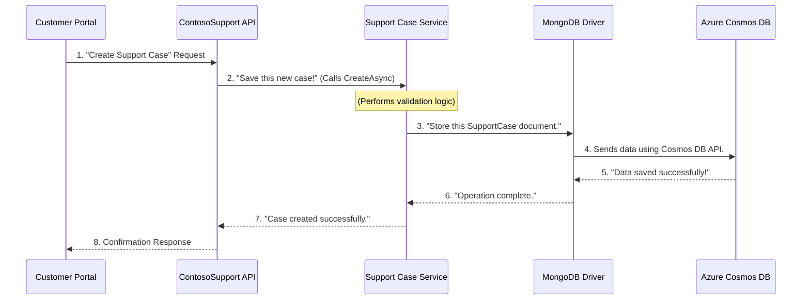

# Chapter 3: Data Persistence Layer

Welcome back! In our previous chapter, [Chapter 2: Support Case & Person Management](02_support_case___person_management_.md), we learned about the "departments" (our services like `SupportServiceCosmosDb`) that manage our important data: `SupportCase` and `SupportPerson`. These departments know all the rules and logic for handling support issues and agents.

But here's a crucial question: where do these "departments" actually **store** all this information? Imagine if every time you closed your customer support application, all the open cases and agent details just disappeared! That wouldn't be very useful, would it?

This is where the **Data Persistence Layer** comes in.

### Why Do We Need a "Memory" for Our Application?

Think of our application like a person. So far, we've given it a "brain" (the API application) and "skills" (the services). But without a "memory," it can't remember anything long-term. Every time it restarts, it would forget all the support cases, who's working on them, and all the details about our support staff.

The Data Persistence Layer is essentially the application's **long-term memory** or its **secure, scalable filing cabinet**. It's where all the important information is safely stored so it can be retrieved later, even if the application goes offline or is updated.

### What is the Data Persistence Layer?

In `ContosoSupport`, the Data Persistence Layer is an **abstraction**. Don't let that fancy word scare you! It simply means it's a way of **hiding the complicated details** of how data is saved and loaded.

Instead of our "departments" (the services) needing to know the nitty-gritty about files, hard drives, or network connections to a database, the Data Persistence Layer provides a simple, clean way for them to say:

*   "Please **save** this new support case!"
*   "Please **find** me all active support persons!"
*   "Please **update** this case with new information!"

It's like having a dedicated "filing clerk" who knows exactly how to put documents into the right drawers and find them quickly, so the "department managers" (our services) don't have to worry about the actual filing system.

### Our Filing Cabinet: Azure Cosmos DB

For our ContosoSupport project, our "filing cabinet" is a special kind of database in the cloud called **Azure Cosmos DB**.

*   **Azure**: This means it's a service provided by Microsoft in their cloud computing platform. It's highly available and reliable, meaning our data is very safe and always accessible.
*   **Cosmos DB**: It's a "NoSQL" database, which means it's designed to handle large amounts of data very quickly and efficiently, especially when that data doesn't fit neatly into traditional rows and columns like a spreadsheet.
*   **MongoDB-compatible API**: This is important for us! Cosmos DB can understand and respond to requests made in a language (or "API") similar to popular database called MongoDB. This makes it easier for our C# application to talk to it, as there are existing tools (like the MongoDB Driver) that know how to speak this language.

So, `Azure Cosmos DB` is our robust, secure, and always-on storage solution.

### How Our Services "Talk" to the Filing Cabinet

Remember our "actual workers" from Chapter 2, `SupportServiceCosmosDb` and `SupportPersonServiceCosmosDb`? Their names hint at it: they use Cosmos DB!

These services are the ones that actually interact with the Data Persistence Layer. When the `SupportCasesController` asks `SupportServiceCosmosDb` to `CreateAsync` a new support case, the `SupportServiceCosmosDb` then takes that data and sends it to Cosmos DB for storage.

Let's look at a simplified version of how `SupportServiceCosmosDb` creates a new case and saves it:

```csharp
// File: src/ContosoAdsSupport/ContosoSupport/Services/SupportServiceCosmosDb.cs

namespace ContosoSupport.Services
{
    internal sealed class SupportServiceCosmosDb : ISupportService
    {
        // This is our connection to the 'SupportCases' filing cabinet drawer
        private readonly IMongoCollection<SupportCase> supportCases; 

        // Constructor: This runs when the service is "hired"
        public SupportServiceCosmosDb(IConfiguration config, ISupportPersonService? supportPersonService = null)
        {
            // Connect to Cosmos DB using a special "client"
            var client = new MongoClient(config.GetConnectionString("SupportCasesDb"));
            
            // Get the specific "database" and "collection" (like a database and a drawer)
            supportCases = client.GetDatabase("SupportCasesDb").GetCollection<SupportCase>("SupportCases");
            // ... (other setup details) ...
        }

        public async Task CreateAsync(SupportCase supportCase)
        {
            // ... (validation logic, as seen in Chapter 2) ...

            // THIS IS THE LINE THAT SAVES THE DATA TO COSMOS DB!
            await supportCases.InsertOneAsync(supportCase).ConfigureAwait(false);
            
            // ... (telemetry and error handling) ...
        }

        // ... (other methods like GetAsync, UpdateAsync, RemoveAsync) ...
    }
}
```

**Explanation of the Code:**

*   `IMongoCollection<SupportCase> supportCases;`: This is a special tool from the MongoDB library that represents our "drawer" where `SupportCase` items are stored.
*   `new MongoClient(...)`: This line creates a "connection" to our Azure Cosmos DB. It uses a "connection string" from our application settings to know *where* to connect.
*   `client.GetDatabase(...).GetCollection(...)`: This gets us access to a specific "database" (like a whole filing cabinet room) and then a specific "collection" (like a specific drawer, in this case, for `SupportCases`).
*   `await supportCases.InsertOneAsync(supportCase)`: This is the magic line! It tells the `supportCases` collection (our `SupportCases` drawer in Cosmos DB) to `InsertOne` new `supportCase` document. This operation happens "asynchronously" (`await`), meaning the application can do other things while the database is busy saving.

### The Journey of Data: From Request to Persistence

Let's visualize the entire flow, focusing on where the Data Persistence Layer fits in:



**Detailed Steps:**

1.  **Customer Portal Request**: A user or another application sends a request to the `ContosoSupport API` to create a new `SupportCase`.
2.  **API to Service**: The `ContosoSupport API` (specifically, its `SupportCasesController`) delegates this task to the `Support Case Service` (`SupportServiceCosmosDb`).
3.  **Service Processes**: The `Support Case Service` performs its business logic (like validating the input data, as we saw in Chapter 2).
4.  **Service to MongoDB Driver**: Once the data is validated, the `Support Case Service` uses the `MongoDB Driver` (a special library in our code) to "talk" to Cosmos DB. It says, "Here's a `SupportCase` object, please store it."
5.  **Driver to Cosmos DB**: The `MongoDB Driver` translates this request into a format that `Azure Cosmos DB` understands and sends the data over the network.
6.  **Cosmos DB Saves**: `Azure Cosmos DB` receives the data and securely stores it in its "filing cabinet."
7.  **Cosmos DB Responds**: `Azure Cosmos DB` sends a confirmation back to the `MongoDB Driver` indicating success.
8.  **Driver to Service**: The `MongoDB Driver` passes this success message back to the `Support Case Service`.
9.  **Service to API**: The `Support Case Service` then tells the `ContosoSupport API` that the case was successfully created.
10. **API to Customer Portal**: Finally, the `ContosoSupport API` sends a confirmation response back to the original requester.

This entire process ensures that our data is securely saved and can be retrieved whenever needed.

### Setting Up the Connection

How does our application know *where* this Azure Cosmos DB "filing cabinet" is located? This is configured in the `Program.cs` file and `appsettings.json`.

In `Program.cs`, we tell our application to use `SupportServiceCosmosDb` (and `SupportPersonServiceCosmosDb`) as the actual implementation for managing data:

```csharp
// File: src/ContosoAdsSupport/ContosoSupport/Program.cs

var builder = WebApplication.CreateBuilder(args);

// ... (other setup for logging, CORS etc.) ...

// These lines register our internal services:
builder.Services
    // When someone needs ISupportService, use SupportServiceCosmosDb
    .AddSingleton<ISupportService, SupportServiceCosmosDb>() 
    // When someone needs ISupportPersonService, use SupportPersonServiceCosmosDb
    .AddSingleton<ISupportPersonService, SupportPersonServiceCosmosDb>(); 

var app = builder.Build();

// ... (more setup) ...
```

**Explanation:**
The lines `AddSingleton<ISupportService, SupportServiceCosmosDb>()` tell the application: "When any part of the system needs to perform operations defined by `ISupportService` (like creating a case), use the `SupportServiceCosmosDb` class to do it." It's like assigning the "Support Case Department Manager" to the role. Since `SupportServiceCosmosDb` knows how to talk to Cosmos DB, this is how the connection is made.

But where does `SupportServiceCosmosDb` get the actual address to Cosmos DB? That's in `appsettings.json`:

```json
// File: src/ContosoAdsSupport/ContosoSupport/appsettings.json

{
  // ... (other settings) ...
  "ConnectionStrings": {
    "SupportCasesDb": "mongodb://localhost:C2y6yDjf5/R+ob0N8A7C..." // This is a simplified example
  },
  // ... (more settings) ...
}
```

**Explanation:**
The `ConnectionStrings` section holds the "address" (and possibly "keys" or "passwords") needed to connect to the database. The `SupportCasesDb` entry holds a special string that `MongoClient` (used in `SupportServiceCosmosDb`) understands, telling it exactly how to reach and authenticate with our `Azure Cosmos DB`.

### Conclusion

In this chapter, we've uncovered the vital role of the **Data Persistence Layer** in our ContosoSupport application. We learned that it:

*   Provides the **long-term memory** for our application, storing crucial data like support cases and support persons.
*   Acts as an **abstraction**, simplifying how our services save and retrieve data by hiding complex database interactions.
*   Leverages **Azure Cosmos DB** as its secure, scalable, and always-available "filing cabinet," using a MongoDB-compatible way to communicate.

Now that our application can securely store and retrieve data, how do we know if it's running smoothly? What if something goes wrong? That's what we'll explore in the next chapter, where we discuss how to "watch" and "understand" our application's behavior.

[Next Chapter: Observability (Telemetry)](04_observability__telemetry__.md)

---

<sub><sup>**References**: [[1]](https://github.com/davidkhalifa/ContosoSupport/blob/c01f43d9f8c812eb393ce94a0c83eca726799fd7/src/ContosoAdsSupport/ContosoSupport/ContosoSupport.csproj), [[2]](https://github.com/davidkhalifa/ContosoSupport/blob/c01f43d9f8c812eb393ce94a0c83eca726799fd7/src/ContosoAdsSupport/ContosoSupport/Program.cs), [[3]](https://github.com/davidkhalifa/ContosoSupport/blob/c01f43d9f8c812eb393ce94a0c83eca726799fd7/src/ContosoAdsSupport/ContosoSupport/Services/SupportPersonServiceCosmosDb.cs), [[4]](https://github.com/davidkhalifa/ContosoSupport/blob/c01f43d9f8c812eb393ce94a0c83eca726799fd7/src/ContosoAdsSupport/ContosoSupport/Services/SupportServiceCosmosDb.cs), [[5]](https://github.com/davidkhalifa/ContosoSupport/blob/c01f43d9f8c812eb393ce94a0c83eca726799fd7/src/ContosoAdsSupport/ContosoSupport/appsettings.json)</sup></sub>
