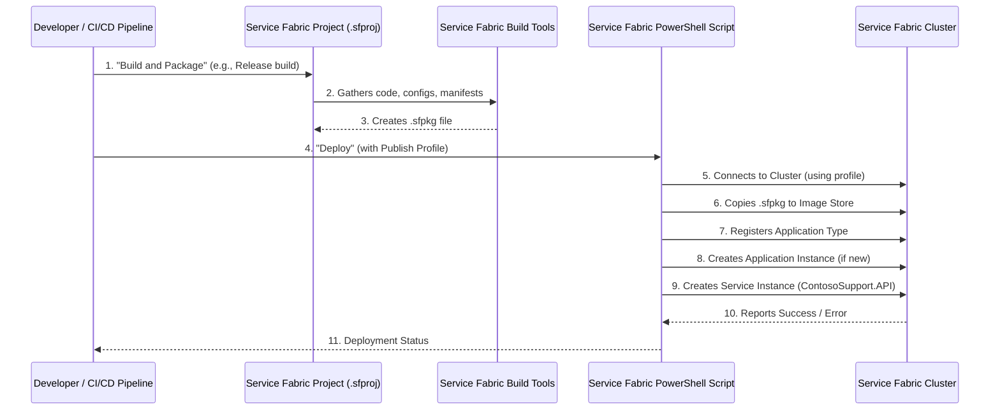

# Chapter 5: Service Fabric Application Deployment

Welcome back! In our previous chapter, [Chapter 4: Observability (Telemetry)](04_observability__telemetry__.md), we learned how to "watch" and "understand" our ContosoSupport application's behavior using logs, metrics, and traces. We now have a robust API that talks to a database and provides insights into its operations.

But there's one big question left: How do we get this application from our development computer out into the real world, running reliably, and ready to handle thousands of customer support cases without breaking a sweat? How do we make sure it stays available even if one server goes down?

This is where **Service Fabric Application Deployment** comes in.

### Why Do We Need a Special Way to Deploy?

Imagine our `ContosoSupport` API Application, along with its internal services and connection to Cosmos DB, is like a highly trained team ready to help customers. Now, how do we get this team set up in a proper office building that can handle many customers, stay open 24/7, and expand if needed?

Just copying the `ContosoSupport.exe` file to a server isn't enough for a modern, always-on application. We need:
*   **High Availability**: If one server crashes, the application should still run on another.
*   **Scalability**: If customer support requests surge, we need to easily add more capacity.
*   **Reliable Upgrades**: We should be able to update our application without downtime.

Azure Service Fabric is Microsoft's solution for building and running distributed microservices. Think of it as a **"distributed operating system"** or a **"town manager"** for a group of virtual machines (VMs). Instead of deploying our application to just *one* server, we deploy it to a *cluster* of servers managed by Service Fabric. Service Fabric then handles all the complex tasks of distributing our application, monitoring it, and keeping it running smoothly across those machines.

For `ContosoSupport`, it means our API can run across multiple virtual machines in an Azure Service Fabric cluster, ensuring high availability and the ability to scale up or down as needed.

### The "Special Installation Package": The Service Fabric Application Package (.sfpkg)

To deploy our `ContosoSupport` API to Service Fabric, we don't just send the raw code. We create a special "installation package" called an **Application Package**, which is essentially a `.sfpkg` file (like a `.zip` file for Service Fabric).

This `.sfpkg` file contains everything Service Fabric needs to understand and run our application. It's like preparing a perfectly organized box with all the instructions and components inside, so the "town manager" (Service Fabric) knows exactly how to set up our "office" (ContosoSupport API) across its "town" (the cluster of VMs).

This package includes key "blueprints":
1.  **Application Manifest**: The master plan for the entire application.
2.  **Service Manifest**: The blueprint for each individual service (our API).

Let's look at these blueprints.

#### 1. The Master Plan: Application Manifest (`ApplicationManifest.xml`)

This file describes the entire Service Fabric application. It lists all the different services that make up our `ContosoSupport` system (though currently, we only have one: our API). It's like the master blueprint for a multi-building complex, defining what types of buildings are there, how many, and their overall settings.

For `ContosoSupport`, our `ApplicationManifest.xml` looks something like this (simplified):

```xml
<!-- File: src/ContosoAdsSupport/ContosoSupport.API.SF.GE/ApplicationPackageRoot/ApplicationManifest.xml -->
<ApplicationManifest ApplicationTypeName="ContosoSupport.API.SF.GEType"
                     ApplicationTypeVersion="1.0.0"
                     xmlns="http://schemas.microsoft.com/2011/01/fabric">
  <Parameters>
    <Parameter Name="ContosoSupport.API_InstanceCount" DefaultValue="-1" />
  </Parameters>
  <ServiceManifestImport>
    <ServiceManifestRef ServiceManifestName="ContosoSupport.APIPkg" ServiceManifestVersion="1.0.0" />
    <!-- This links to the blueprint for our API service -->
  </ServiceManifestImport>
  <DefaultServices>
    <Service Name="ContosoSupport.API">
      <StatelessService ServiceTypeName="ContosoSupport.APIType" InstanceCount="[ContosoSupport.API_InstanceCount]">
        <SingletonPartition />
      </StatelessService>
    </Service>
  </DefaultServices>
  <Principals>
    <ManagedIdentities>
      <ManagedIdentity Name="ContosoSupportAssignedIdentity" />
    </ManagedIdentities>
  </Principals>
</ApplicationManifest>
```

**Explanation:**
*   `ApplicationTypeName`: This is a unique name for our application type (e.g., `ContosoSupport.API.SF.GEType`).
*   `ApplicationTypeVersion`: The version of our application (e.g., `1.0.0`). This is crucial for seamless upgrades!
*   `ServiceManifestImport`: This section tells Service Fabric where to find the *blueprint for our actual API service*. It refers to `ContosoSupport.APIPkg`.
*   `DefaultServices`: This part says "When you install this application, please also create an instance of our `ContosoSupport.API` service."
    *   `InstanceCount="-1"`: This is important! It tells Service Fabric to run our API on *all* available nodes (virtual machines) in the cluster. This provides high availability and automatic scaling across the cluster.
*   `ManagedIdentities`: This part defines how our application can securely access other Azure resources (like Cosmos DB) without needing passwords stored directly in the code. We'll learn more about this in [Chapter 6: Infrastructure as Code (ARM Templates)](06_infrastructure_as_code__arm_templates__.md).

#### 2. The Service Blueprint: Service Manifest (`ServiceManifest.xml`)

While the Application Manifest describes the *overall application*, the `ServiceManifest.xml` describes a *single service* within that application. For us, this is the blueprint for our `ContosoSupport` API. It's like the detailed architectural plans for one specific building in the complex.

```xml
<!-- File: src/ContosoAdsSupport/ContosoSupport.API.SF.GE/ApplicationPackageRoot/ContosoSupport.APIPkg/ServiceManifest.xml -->
<ServiceManifest Name="ContosoSupport.APIPkg"
                 Version="1.0.0"
                 xmlns="http://schemas.microsoft.com/2011/01/fabric">
  <ServiceTypes>
    <StatelessServiceType ServiceTypeName="ContosoSupport.APIType" UseImplicitHost="true" />
  </ServiceTypes>
  <CodePackage Name="Code" Version="1.0.0">
    <EntryPoint>
      <ExeHost>
        <Program>ContosoSupport.exe</Program>
        <WorkingFolder>CodePackage</WorkingFolder>
        <ConsoleRedirection FileRetentionCount="5" FileMaxSizeInKb="2048"/> 
      </ExeHost>
    </EntryPoint>
  </CodePackage>
  <ConfigPackage Name="Config" Version="1.0.0" />
  <Resources>
    <Endpoints>
      <Endpoint Name="ContosoSupport.APITypeEndpoint" Protocol="http" Type="Input" Port="5000" />
    </Endpoints>
    <ManagedIdentities DefaultIdentity="WebAdmin">
      <ManagedIdentity Name="WebAdmin" />
    </ManagedIdentities>
  </Resources>
</ServiceManifest>
```

**Explanation:**
*   `ServiceManifest Name`: The name of this service package (e.g., `ContosoSupport.APIPkg`).
*   `ServiceTypeName`: The type name of our service (e.g., `ContosoSupport.APIType`). This is referenced in the Application Manifest.
*   `CodePackage`: This is where we tell Service Fabric where to find our actual executable code (`.exe` file).
    *   `<Program>ContosoSupport.exe</Program>`: This is the actual ContosoSupport API application we built in [Chapter 1: ContosoSupport API Application](01_contososupport_api_application_.md).
    *   `<WorkingFolder>CodePackage</WorkingFolder>`: Specifies where the `ContosoSupport.exe` will be located within the package.
*   `ConfigPackage`: This points to where our configuration files (like `appsettings.json` from [Chapter 3: Data Persistence Layer](03_data_persistence_layer_.md) which holds our database connection string) will be stored.
*   `Endpoints`: This defines the network address where our API can be reached within the cluster.
    *   `Port="5000"`: Our API will listen for incoming requests on port 5000.

### Creating the `.sfpkg` File: The Packaging Process

So, how do we get all these files (our `ContosoSupport.exe`, `appsettings.json`, and these XML manifests) into that neat `.sfpkg` package?

We use a special Visual Studio project type for Service Fabric applications, called a `.sfproj` file. This project file acts like a recipe, telling the build tools how to gather all the necessary files and package them correctly.

A crucial part of our `ContosoSupport.API.SF.GE.sfproj` looks like this (simplified):

```xml
<!-- File: src/ContosoAdsSupport/ContosoSupport.API.SF.GE/ContosoSupport.API.SF.GE.sfproj -->
<Project ToolsVersion="14.0" DefaultTargets="Build" xmlns="http://schemas.microsoft.com/developer/msbuild/2003">
  <!-- ... (other project settings) ... -->
  <ItemGroup>
    <Content Include="..\ContosoSupport\appsettings.json">
      <Link>ApplicationPackageRoot\ContosoSupport.APIPkg\Config\appsettings.json</Link>
    </Content>
    <Content Include="..\ContosoSupport\bin\Release\net8.0\win-x64\publish\**\*.*">
      <Link>ApplicationPackageRoot\ContosoSupport.APIPkg\Code\%(RecursiveDir)%(Filename)%(Extension)</Link>
    </Content>
    <Content Include="ApplicationPackageRoot\ContosoSupport.APIPkg\ServiceManifest.xml" />
    <None Include="ApplicationPackageRoot\ApplicationManifest.xml" />
    <!-- ... (references to publish profiles etc.) ... -->
  </ItemGroup>
  <!-- ... (import build targets) ... -->
</Project>
```

**Explanation:**
*   `Content Include`: These lines are like instructions saying "take this file from here and put it into the package here."
    *   `..\ContosoSupport\appsettings.json`: Our configuration file.
    *   `..\ContosoSupport\bin\Release\net8.0\win-x64\publish\**\*.*`: This is the most important part! It takes *all* the compiled and published files of our `ContosoSupport.exe` application and includes them in the `Code` folder of the Service Fabric package. This is where our actual application logic resides.
*   `ServiceManifest.xml` and `ApplicationManifest.xml`: These are also explicitly included in the package.

When we build this `.sfproj` project in "Release" mode (or run a script like `simulate-build.bat`), it compiles our `ContosoSupport` API, gathers its published output, includes the manifest files, and zips it all up into a `.sfpkg` file.

### Different Deployment Plans: Publish Profiles

Once we have our `.sfpkg` file, we need a way to tell Service Fabric *how* to deploy it. Should it go to our local computer's test cluster? Or to a full-fledged cluster in Azure? This is handled by **Publish Profiles**.

A Publish Profile is an XML file that contains settings specific to a deployment environment. It's like having different instruction manuals for setting up our "office building" depending on whether it's a small temporary setup in a local park or a permanent, large-scale building in a bustling city.

Let's look at two examples:

#### Local Deployment (`Local.1Node.xml`)

This profile is for deploying to a local Service Fabric cluster on your development machine. This is great for quick testing!

```xml
<!-- File: src/ContosoAdsSupport/ContosoSupport.API.SF.GE/PublishProfiles/Local.1Node.xml -->
<PublishProfile xmlns="http://schemas.microsoft.com/2015/05/fabrictools">
  <ClusterConnectionParameters /> <!-- No special connection needed for local -->
  <ApplicationParameterFile Path="..\ApplicationParameters\Local.1Node.xml" />
  <UpgradeDeployment Mode="UnmonitoredAuto" Enabled="false">
    <Parameters UpgradeReplicaSetCheckTimeoutSec="1" Force="True" />
  </UpgradeDeployment>
</PublishProfile>
```

**Explanation:**
*   `ClusterConnectionParameters`: For a local cluster, you usually don't need any special connection details.
*   `ApplicationParameterFile`: This points to another XML file (`Local.1Node.xml`) which can override parameters defined in the `ApplicationManifest.xml` for local testing.

#### Cloud Deployment (`Cloud.xml`)

This profile is for deploying to a Service Fabric cluster running in Azure. This requires more specific connection details.

```xml
<!-- File: src/ContosoAdsSupport/ContosoSupport.API.SF.GE/PublishProfiles/Cloud.xml -->
<PublishProfile xmlns="http://schemas.microsoft.com/2015/05/fabrictools">
  <ClusterConnectionParameters ConnectionEndpoint="" /> <!-- Needs real cluster endpoint -->
  <ApplicationParameterFile Path="..\ApplicationParameters\Cloud.xml" />
  <CopyPackageParameters CompressPackage="true" />
</PublishProfile>
```

**Explanation:**
*   `ClusterConnectionParameters ConnectionEndpoint=""`: This is where you would specify the address of your Service Fabric cluster in Azure. For security, these are often filled in by automated deployment pipelines, not hardcoded.
*   `CompressPackage="true"`: This tells the deployment process to compress the `.sfpkg` file, which is good for faster deployment over the internet to Azure.

### The Deployment Process: From Package to Running Application

Once we have our `.sfpkg` file and choose a `PublishProfile.xml`, the actual deployment happens through PowerShell scripts. In our project, the `Deploy-FabricApplication.ps1` script is the main driver. This script is usually invoked by Visual Studio or by an automated build system (like Azure DevOps).

Here's a simplified flow of what happens during deployment:



**Detailed Steps:**

1.  **Build and Package**: The developer (or an automated system) initiates a "build and package" command on the `.sfproj` project (e.g., in Visual Studio or by running `dotnet msbuild`).
2.  **Gathering Files**: The `Service Fabric Build Tools` follow the instructions in the `.sfproj` and the manifests to collect the `ContosoSupport.exe`, `appsettings.json`, and all manifest files.
3.  **Create `.sfpkg`**: All these components are bundled into the `.sfpkg` file.
4.  **Initiate Deployment**: The developer (or automated system) then triggers the deployment using the `Deploy-FabricApplication.ps1` PowerShell script, providing a specific `PublishProfile.xml` (e.g., `Cloud.xml`).
5.  **Connect to Cluster**: The PowerShell script uses the `ClusterConnectionParameters` from the chosen `PublishProfile` to connect to the target `Service Fabric Cluster`.
6.  **Copy Package**: The script then copies the `.sfpkg` file to a special storage area within the cluster called the "Image Store."
7.  **Register Application Type**: Service Fabric reads the `ApplicationManifest.xml` from the copied package and "registers" a new application type in the cluster. This is like telling the "town manager": "I have a new type of office building blueprint available."
8.  **Create Application Instance**: If it's a new deployment, Service Fabric then creates an "application instance" based on the registered type. This is like saying: "Now, actually build one of those office buildings in our town."
9.  **Create Service Instance**: Finally, Service Fabric reads the `DefaultServices` section of the `ApplicationManifest.xml` and creates an instance of our `ContosoSupport.API` service within the application instance. This is where our `ContosoSupport.exe` starts running across the specified number of nodes (VMs) in the cluster.
10. **Status Report**: The cluster reports back to the PowerShell script whether the deployment was successful or if there were any issues.
11. **Feedback to Developer**: The script then informs the developer (or the automation system) about the deployment status.

This layered approach (packaging into `.sfpkg`, defining manifests, using publish profiles, and automating with scripts) ensures that our `ContosoSupport` API can be reliably deployed, managed, and upgraded in a complex distributed environment like Azure Service Fabric.

### Conclusion

In this chapter, we demystified **Service Fabric Application Deployment**, understanding how our `ContosoSupport` API gets packaged and deployed for a highly available, scalable environment. We learned about:

*   The purpose of Service Fabric as a "distributed operating system" for our application.
*   The **Application Package (`.sfpkg`)** as the special installation bundle.
*   The role of the **Application Manifest** (the master plan) and the **Service Manifest** (the service blueprint) in defining our application and its services.
*   How the Visual Studio Service Fabric project (`.sfproj`) helps in bundling our application's code and configurations into the `.sfpkg`.
*   The use of **Publish Profiles** to define deployment settings for different environments (local vs. cloud).
*   The step-by-step process of how our application is deployed to a Service Fabric cluster.

Now that we understand how our application is packaged and deployed, you might be wondering: How do we set up that Service Fabric cluster itself in Azure? How do we automate the creation of the virtual machines, networking, and security settings that Service Fabric runs on? That's exactly what we'll explore in the next chapter!

[Next Chapter: Infrastructure as Code (ARM Templates)](06_infrastructure_as_code__arm_templates__.md)

---
<sub><sup>**References**: [[1]](https://github.com/davidkhalifa/ContosoSupport/blob/c01f43d9f8c812eb393ce94a0c83eca726799fd7/src/ContosoAdsSupport/ContosoSupport.API.SF.GE/ApplicationPackageRoot/ApplicationManifest.xml), [[2]](https://github.com/davidkhalifa/ContosoSupport/blob/c01f43d9f8c812eb393ce94a0c83eca726799fd7/src/ContosoAdsSupport/ContosoSupport.API.SF.GE/ApplicationPackageRoot/ContosoSupport.APIPkg/ServiceManifest.xml), [[3]](https://github.com/davidkhalifa/ContosoSupport/blob/c01f43d9f8c812eb393ce94a0c83eca726799fd7/src/ContosoAdsSupport/ContosoSupport.API.SF.GE/ContosoSupport.API.SF.GE.sfproj), [[4]](https://github.com/davidkhalifa/ContosoSupport/blob/c01f43d9f8c812eb393ce94a0c83eca726799fd7/src/ContosoAdsSupport/ContosoSupport.API.SF.GE/PublishProfiles/Cloud.xml), [[5]](https://github.com/davidkhalifa/ContosoSupport/blob/c01f43d9f8c812eb393ce94a0c83eca726799fd7/src/ContosoAdsSupport/ContosoSupport.API.SF.GE/PublishProfiles/Local.1Node.xml), [[6]](https://github.com/davidkhalifa/ContosoSupport/blob/c01f43d9f8c812eb393ce94a0c83eca726799fd7/src/ContosoAdsSupport/ContosoSupport.API.SF.GE/PublishProfiles/Local.5Node.xml), [[7]](https://github.com/davidkhalifa/ContosoSupport/blob/c01f43d9f8c812eb393ce94a0c83eca726799fd7/src/ContosoAdsSupport/ContosoSupport.API.SF.GE/Scripts/Deploy-FabricApplication.ps1), [[8]](https://github.com/davidkhalifa/ContosoSupport/blob/c01f43d9f8c812eb393ce94a0c83eca726799fd7/src/ContosoAdsSupport/ContosoSupport.API.SF.GE/packages.config), [[9]](https://github.com/davidkhalifa/ContosoSupport/blob/c01f43d9f8c812eb393ce94a0c83eca726799fd7/src/ContosoAdsSupport/SFClusterArmTemplate/Parameters/App.parameters.json), [[10]](https://github.com/davidkhalifa/ContosoSupport/blob/c01f43d9f8c812eb393ce94a0c83eca726799fd7/src/ContosoAdsSupport/SFClusterArmTemplate/Templates/App.template.json), [[11]](https://github.com/davidkhalifa/ContosoSupport/blob/c01f43d9f8c812eb393ce94a0c83eca726799fd7/src/ContosoAdsSupport/SFClusterArmTemplate/simulate-build.bat)</sup></sub>