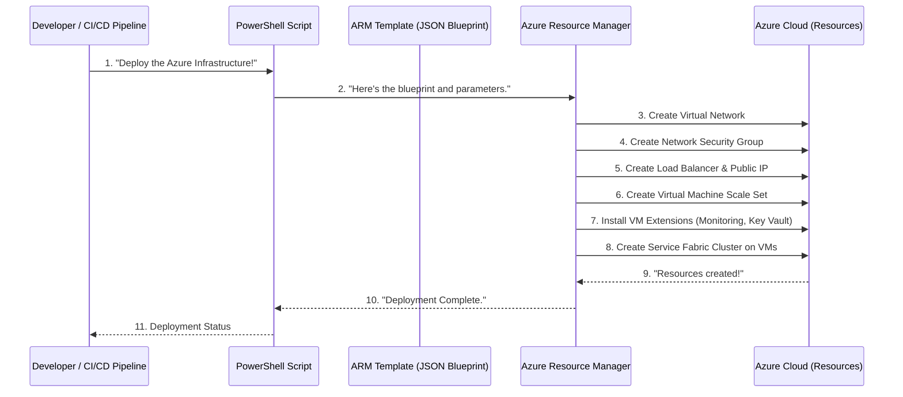

# Chapter 6: Infrastructure as Code (ARM Templates)

Welcome back! In our previous chapter, [Chapter 5: Service Fabric Application Deployment](05_service_fabric_application_deployment_.md), we learned how to package our `ContosoSupport` API application into a special Service Fabric package (`.sfpkg`) and deploy it to an existing Service Fabric cluster. That's great for getting our application running!

But here's a bigger question: **How do we set up that Service Fabric cluster itself in Azure?** How do we create the virtual machines, the networking, the load balancers, the security rules, and connect everything together, ready for Service Fabric to run our application?

Doing all of that manually in the Azure portal or with many separate commands can be slow, error-prone, and inconsistent. Imagine trying to build a new Service Fabric "office building" perfectly identically in different Azure regions or for different testing environments. It would be a nightmare!

This is where **Infrastructure as Code (IaC)** comes in, using **Azure Resource Manager (ARM) Templates**.

### Why "Code" for "Infrastructure"?

Think of it like this:

*   In [Chapter 1: ContosoSupport API Application](01_contososupport_api_application_.md), we wrote **code** (C#) to define how our `ContosoSupport` API behaves. This code ensures it always acts the same way.
*   Now, we'll write **code** (JSON files) to define how our Azure infrastructure should be built. This code, called an **ARM Template**, acts like a detailed architectural blueprint. It describes *exactly* what Azure resources (like virtual machines, networks, load balancers, and the Service Fabric cluster itself) we need, and how they should be configured.

**The big problem Infrastructure as Code solves**: It ensures that our entire Azure environment can be consistently and repeatedly provisioned (or "built") in any environment, supporting automated deployments (e.g., in a CI/CD pipeline). No more "it works on my machine!" for infrastructure!

### Our Blueprint: Azure Resource Manager (ARM) Templates

Our "blueprints" for building Azure resources are special files called **Azure Resource Manager (ARM) Templates**. They are written in **JSON** (JavaScript Object Notation), which is a common, easy-to-read format for organizing data.

An ARM Template lists all the "ingredients" (Azure resources) and "instructions" (how they are connected and configured) needed to create a complete environment.

Let's look at a simplified `ServiceFabricCluster.template.json` which is the core blueprint for our Service Fabric cluster:

```json
// File: src/ContosoAdsSupport/SFClusterArmTemplate/Templates/ServiceFabricCluster.template.json

{
  "$schema": "https://schema.management.azure.com/schemas/2019-04-01/deploymentTemplate.json#",
  "contentVersion": "1.0.0.0",
  "parameters": { // Inputs we can provide when using the blueprint
    "clusterName": { "type": "string" },
    "adminUserName": { "type": "string" },
    "adminPassword": { "type": "securestring" }
    // ... many more parameters ...
  },
  "variables": { // Helper values we can calculate or reuse
    "location": "[resourceGroup().location]",
    "virtualNetworkName": "VNet",
    "subnet0Ref": "[concat(variables('vnetID'), '/subnets/', variables('subnet0Name'))]"
    // ... many more variables ...
  },
  "resources": [ // The actual Azure resources to create
    {
      "apiVersion": "2018-11-01",
      "type": "Microsoft.Network/virtualNetworks",
      "name": "[variables('virtualNetworkName')]",
      "location": "[variables('location')]",
      "properties": { /* ... network settings ... */ }
    },
    {
      "apiVersion": "2018-11-01",
      "type": "Microsoft.Network/loadBalancers",
      "name": "[concat('LB','-', parameters('clusterName'),'-',variables('vmNodeType0Name'))]",
      "location": "[variables('location')]",
      "properties": { /* ... load balancer rules ... */ }
    },
    {
      "apiVersion": "2022-03-01",
      "type": "Microsoft.Compute/virtualMachineScaleSets",
      "name": "[variables('vmNodeType0Name')]",
      "location": "[variables('location')]",
      "properties": { /* ... VM settings and extensions ... */ }
    },
    {
      "apiVersion": "2020-12-01-preview",
      "type": "Microsoft.ServiceFabric/clusters",
      "name": "[parameters('clusterName')]",
      "location": "[variables('location')]",
      "properties": { /* ... Service Fabric cluster settings ... */ }
    }
    // ... many more resources ...
  ],
  "outputs": { /* ... info to get after deployment ... */ }
}
```

**Explanation of the ARM Template Sections:**

*   **`parameters`**: These are like the "blanks" on our blueprint that we fill in when we want to build. For example, we provide the `clusterName` or the `adminUserName` for the virtual machines.
*   **`variables`**: These are reusable values or calculations within the blueprint. For instance, we define `virtualNetworkName` once and reuse it many times, or calculate `subnet0Ref` based on other values. This keeps the blueprint neat.
*   **`resources`**: This is the most important section! It's the list of all the Azure resources that will be created or updated. Each resource has a `type` (what kind of resource it is, like a `virtualNetwork`), a `name`, a `location`, and a `properties` section that describes its specific configuration.
*   **`outputs`**: (Not shown in detail above) These are values that the blueprint can provide back to us after it's done building, like the public IP address of the new cluster.

### The "Builder": PowerShell Scripts

Having a blueprint (the ARM Template) is great, but we need someone to actually *read* the blueprint and *do the building* in Azure. That's where **PowerShell scripts** come in.

Our project uses a script called `Deploy-AzureResourceGroup.ps1`. This script takes our ARM Template and its parameters, connects to Azure, and tells the Azure Resource Manager to start building!

Here's a key part of what that PowerShell script does:

```powershell
# File: src/ContosoAdsSupport/SFClusterArmTemplate/Deploy-AzureResourceGroup.ps1

# ... (parameters and setup) ...

if ($ValidateOnly) {
    # Test the template without actually deploying (like a dry run)
    Test-AzResourceGroupDeployment -ResourceGroupName $ResourceGroupName `
                                   -TemplateFile $TemplateFile `
                                   -TemplateParameterFile $TemplateParametersFile `
                                   @OptionalParameters
}
else {
    # THIS IS THE COMMAND THAT DEPLOYS THE INFRASTRUCTURE!
    New-AzResourceGroupDeployment -Name ((Get-ChildItem $TemplateFile).BaseName + '-' + ((Get-Date).ToUniversalTime()).ToString('MMdd-HHmm')) `
                                       -ResourceGroupName $ResourceGroupName `
                                       -TemplateFile $TemplateFile `
                                       -TemplateParameterFile $TemplateParametersFile `
                                       @OptionalParameters `
                                       -Force -Verbose
}

# ... (error handling) ...
```

**Explanation:**

*   `Test-AzResourceGroupDeployment`: This command lets us "dry run" our template to make sure it's valid and won't cause errors before we actually deploy.
*   `New-AzResourceGroupDeployment`: This is the main command! It tells Azure Resource Manager to take our specified `-TemplateFile` (the blueprint) and `-TemplateParameterFile` (the filled-in blanks for the blueprint) and create/update the resources in the given `-ResourceGroupName` (a logical container in Azure for our resources).

### Filling in the Blanks: Parameter Files

Remember the `parameters` section in our ARM Template? We need a way to provide those values to the PowerShell script. This is done using a **parameter file**, also in JSON format, like `ServiceFabricCluster.parameters.json`:

```json
// File: src/ContosoAdsSupport/SFClusterArmTemplate/Parameters/ServiceFabricCluster.parameters.json

{
  "$schema": "https://schema.management.azure.com/schemas/2015-01-01/deploymentParameters.json#",
  "contentVersion": "1.0.0.0",
  "parameters": {
    "adminUserName": { "value": "azureadmin" },
    "clusterName": { "value": "__Cluster_Name__" }, // This might be filled by an automation system
    "adminPassword": {
      "reference": { // This is a secure way to get passwords from Azure Key Vault
        "keyVault": {
          "id": "/subscriptions/7adeba7f-4949-4201-b9c2-59283fcb5e11/resourceGroups/ContosoAds-CentralResources/providers/Microsoft.KeyVault/vaults/ContosoAdsKeyVault"
        },
        "secretName": "SFPassword"
      }
    },
    // ... many more parameters ...
    "userAssignedIdentityName": { "value": "__User_Assigned_Identity_Name__" }
  }
}
```

**Explanation:**

*   This file provides the `value` for each `parameter` defined in the ARM Template.
*   Notice the `adminPassword`! Instead of putting the password directly in this file (which is a bad idea for security), it uses a `reference` to an Azure Key Vault. This means the deployment process securely pulls the password from Key Vault when it needs it.

### Key Azure Resources Built by the Template

Our `ServiceFabricCluster.template.json` is a comprehensive blueprint that creates a variety of Azure resources to support our `ContosoSupport` application. Here are some of the key resources and their roles:

| Azure Resource Type                | Role in `ContosoSupport` Infrastructure                                                                               |
| :--------------------------------- | :-------------------------------------------------------------------------------------------------------------------- |
| **Virtual Network (VNet)**         | The private, isolated network where all our virtual machines and Service Fabric nodes reside.                         |
| **Network Security Group (NSG)**   | Acts like a firewall, controlling which network traffic can enter or leave our VNet and VMs.                          |
| **Public IP Address**              | A public internet address that allows users to reach our Service Fabric cluster and our `ContosoSupport` API.         |
| **Load Balancer (LB)**             | Distributes incoming network traffic evenly across our Service Fabric nodes, ensuring high availability and performance. |
| **Virtual Machine Scale Set (VMSS)** | A group of identical virtual machines that run our Service Fabric nodes. It allows us to easily scale out (add more VMs) or scale in (remove VMs) automatically. |
| **Service Fabric Cluster**         | The "town manager" (as discussed in [Chapter 5: Service Fabric Application Deployment](05_service_fabric_application_deployment_.md)) that orchestrates and manages our application instances across the VMs. |
| **User Assigned Managed Identity** | A secure identity for our Service Fabric cluster (and later, our application) to access other Azure resources (like Azure Cosmos DB from [Chapter 3: Data Persistence Layer](03_data_persistence_layer_.md) or Azure Key Vault) without needing passwords. |
| **Geneva Monitoring Agent (VM Extension)** | An agent installed on our VMs that collects all the telemetry (logs, metrics, traces) we discussed in [Chapter 4: Observability (Telemetry)](04_observability__telemetry__.md) and sends it to our central monitoring system. |
| **Key Vault for Windows (VM Extension)** | Helps securely get certificates and secrets from Azure Key Vault and make them available to the VMs. |

### The Infrastructure Deployment Flow

Let's visualize how the ARM Template and PowerShell script work together to build our Azure infrastructure:



**Detailed Steps:**

1.  **Initiate Deployment**: A developer or an automated CI/CD pipeline (Continuous Integration/Continuous Deployment) triggers the `Deploy-AzureResourceGroup.ps1` PowerShell script.
2.  **Script to Azure Resource Manager**: The PowerShell script securely connects to Azure and sends the `ServiceFabricCluster.template.json` (our blueprint) and `ServiceFabricCluster.parameters.json` (the filled-in parameters) to the **Azure Resource Manager**.
3.  **Azure Resource Manager Builds**: The **Azure Resource Manager** is the "orchestrator" in Azure. It reads the blueprint and starts creating all the specified `resources` in the `Azure Cloud`. It handles the order, dependencies, and ensures everything is set up correctly. This includes creating the Virtual Network, Network Security Groups, Public IP, Load Balancer, Virtual Machine Scale Sets (our VMs), and installing necessary VM Extensions (like the Geneva Monitoring Agent).
4.  **Service Fabric Cluster Creation**: As part of this, the Azure Resource Manager also creates the **Service Fabric Cluster** itself, ensuring it runs on the Virtual Machine Scale Set nodes.
5.  **Completion and Status**: Once all resources are provisioned and configured according to the template, the `Azure Cloud` reports success back to the `Azure Resource Manager`, which then notifies the `PowerShell Script`. Finally, the script provides a status update to the developer or CI/CD pipeline.

### Conclusion

In this chapter, we've explored the powerful concept of **Infrastructure as Code (IaC)**, specifically using **Azure Resource Manager (ARM) Templates**. We learned that:

*   It solves the problem of inconsistent and manual Azure infrastructure setup by defining our entire environment as a **JSON blueprint**.
*   **ARM Templates** (`.template.json` files) describe all the Azure resources (networks, VMs, load balancers, Service Fabric clusters) and their configurations.
*   **Parameter files** (`.parameters.json`) allow us to fill in specific values (like cluster names or secure passwords from Key Vault) when we run the blueprint.
*   **PowerShell scripts** (`Deploy-AzureResourceGroup.ps1`) act as the "builder," taking the blueprint and telling Azure Resource Manager to deploy the infrastructure.

With Infrastructure as Code, we can spin up identical, fully configured Azure environments for `ContosoSupport` quickly, consistently, and reliably, whether for development, testing, or production. This automation is key to managing complex cloud applications.

---

<sub><sup>**References**: [[1]](https://github.com/davidkhalifa/ContosoSupport/blob/c01f43d9f8c812eb393ce94a0c83eca726799fd7/src/ContosoAdsSupport/SFClusterArmTemplate/BuildVer.txt), [[2]](https://github.com/davidkhalifa/ContosoSupport/blob/c01f43d9f8c812eb393ce94a0c83eca726799fd7/src/ContosoAdsSupport/SFClusterArmTemplate/ClusterWithApp.RolloutSpec.json), [[3]](https://github.com/davidkhalifa/ContosoSupport/blob/c01f43d9f8c812eb393ce94a0c83eca726799fd7/src/ContosoAdsSupport/SFClusterArmTemplate/ClusterWithApp.ServiceModel.json), [[4]](https://github.com/davidkhalifa/ContosoSupport/blob/c01f43d9f8c812eb393ce94a0c83eca726799fd7/src/ContosoAdsSupport/SFClusterArmTemplate/Deploy-AzureResourceGroup.ps1), [[5]](https://github.com/davidkhalifa/ContosoSupport/blob/c01f43d9f8c812eb393ce94a0c83eca726799fd7/src/ContosoAdsSupport/SFClusterArmTemplate/New-ServiceFabricClusterCertificate.ps1), [[6]](https://github.com/davidkhalifa/ContosoSupport/blob/c01f43d9f8c812eb393ce94a0c83eca726799fd7/src/ContosoAdsSupport/SFClusterArmTemplate/Parameters/ServiceFabricCluster.parameters.json), [[7]](https://github.com/davidkhalifa/ContosoSupport/blob/c01f43d9f8c812eb393ce94a0c83eca726799fd7/src/ContosoAdsSupport/SFClusterArmTemplate/SFClusterArmTemplate.deployproj), [[8]](https://github.com/davidkhalifa/ContosoSupport/blob/c01f43d9f8c812eb393ce94a0c83eca726799fd7/src/ContosoAdsSupport/SFClusterArmTemplate/ScopeBindings.json), [[9]](https://github.com/davidkhalifa/ContosoSupport/blob/c01f43d9f8c812eb393ce94a0c83eca726799fd7/src/ContosoAdsSupport/SFClusterArmTemplate/Templates/ServiceFabricCluster.template.json), [[10]](https://github.com/davidkhalifa/ContosoSupport/blob/c01f43d9f8c812eb393ce94a0c83eca726799fd7/src/ContosoAdsSupport/SFClusterArmTemplate/readme.txt)</sup></sub>